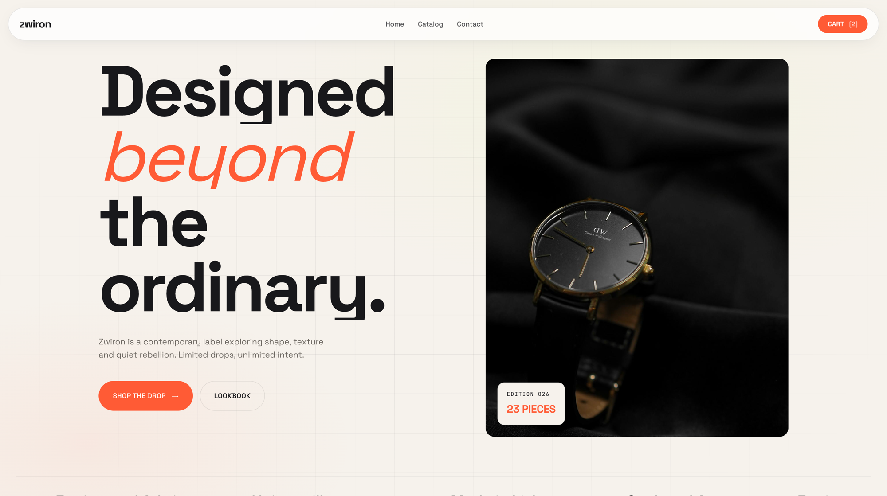

# Zwiron — Shopify Theme

A modern, editorial Shopify theme built on top of Shopify's **Horizon** with a custom Zwiron design system. Light, aesthetic, lightly animated with GSAP.



**Live demo →** [zwiron.myshopify.com](https://zwiron.myshopify.com/)
Password: `zahinafsar`

---

## About

Zwiron is a fictional contemporary fashion label. The theme treats the storefront as an editorial publication: cream palette, bold display typography, italic accents in coral, generous whitespace, and just enough motion to feel alive.

It ships with custom-built sections for every important page so the look stays cohesive end-to-end — no native Shopify card or layout makes it through unchanged.

## Features

- **Custom sections** for nav, hero, products, social, FAQ, footer, collection list, single collection, and product detail.
- **Right-side cart drawer** with AJAX add-to-cart. The `/cart` route redirects to home and auto-opens the drawer.
- **No `/search` route** — search is replaced by a client-side filter on the collection page (it redirects to `/collections/all`).
- **Shared `zwiron-product-card` snippet** so the product card looks identical across home, collection, and related-products grids.
- **Gallery on product page** — main image with hover-to-zoom (cursor-driven `transform-origin`) plus thumbnail row.
- **Sort, search, and tag filters** on every collection page.
- **GSAP scroll-driven horizontal pin** on the social/Instagram strip.
- **IntersectionObserver-based fade-in reveals** for everything else (smooth, no scroll-trigger position drift).
- **Light mode only** — cream `#f5f2ec` background, near-black text, coral `#ff5b35` accent.
- **Type system** — `Space Grotesk` for display, `JetBrains Mono` for labels.

## Tech

- Shopify Liquid (Online Store 2.0 sections + JSON templates)
- Vanilla JS + [GSAP](https://gsap.com/) + ScrollTrigger
- CSS custom properties, no preprocessor
- Pexels imagery for placeholder content (fetched at build time)

## Project structure

```
.
├── assets/
│   ├── zwiron.css         # brand layer + sections + native overrides
│   └── zwiron.js          # GSAP init, cart drawer, product gallery, search
├── blocks/                # native Horizon blocks (untouched)
├── config/                # native Horizon settings (untouched)
├── layout/
│   └── theme.liquid       # adds GSAP CDN + zwiron assets, mounts global sections
├── locales/               # native Horizon locales
├── sections/
│   ├── zwiron-nav.liquid
│   ├── zwiron-hero.liquid
│   ├── zwiron-products.liquid
│   ├── zwiron-social.liquid
│   ├── zwiron-faq.liquid
│   ├── zwiron-footer.liquid
│   ├── zwiron-cart-drawer.liquid
│   ├── zwiron-collection.liquid
│   ├── zwiron-collection-list.liquid
│   ├── zwiron-product.liquid
│   └── zwiron-redirect.liquid
├── snippets/
│   └── zwiron-product-card.liquid
└── templates/
    ├── index.json
    ├── collection.json
    ├── list-collections.json
    ├── product.json
    ├── cart.json          # uses zwiron-redirect → /
    └── search.json        # uses zwiron-redirect → /collections/all
```

## Local development

This theme uses the Shopify CLI.

```bash
# install Shopify CLI (macOS)
brew tap shopify/shopify
brew install shopify-cli

# clone
git clone https://github.com/zahinafsar/zwiron-shopify-theme.git
cd zwiron-shopify-theme

# log in to your dev store
shopify auth login --store your-store.myshopify.com

# preview locally with hot reload
shopify theme dev

# push to a remote theme
shopify theme push
```

### Pushing notes

Shopify rejects pushing two templates with the same base name and different extensions (e.g. `cart.json` and `cart.liquid`). If you see `Filename X already exists with Y extension`, delete the conflicting file from the remote theme via **Online Store → Themes → Edit code**, then push again.

## Customization

### Brand palette

All colors are CSS custom properties at the top of `assets/zwiron.css`:

```css
:root {
  --zw-bg: #f5f2ec;
  --zw-bg-elev: #ffffff;
  --zw-bg-soft: #ece8df;
  --zw-fg: #18181b;
  --zw-fg-mute: #6b6660;
  --zw-accent: #ff5b35;
  --zw-line: rgba(24, 24, 27, 0.1);
  --zw-radius: 18px;
  --zw-font-display: 'Space Grotesk', ...;
  --zw-font-mono: 'JetBrains Mono', ...;
}
```

Change `--zw-accent` to re-skin the entire theme.

### Sections

Each `zwiron-*` section ships with its own `` block, so all copy and most layout choices are merchant-editable through the Shopify theme editor — no code edits required for content changes.

### Cart drawer behavior

The drawer is mounted globally in `layout/theme.liquid`. Any nav button with `data-zw-cart-open` opens it; any element with `data-zw-cart-close` closes it. `Escape` closes too. After a successful `/cart/add.js`, the drawer fetches `/?sections=zwiron-cart-drawer` to refresh its markup.

### Product gallery zoom

`assets/zwiron.js → initProductGallery()` listens for `mousemove` over `.zw-pp__main` and updates `transform-origin` on the active image — no extra lens markup, just a CSS scale transform.

## Pages built

- `/` — Hero, featured products (5 max, configurable), Instagram-style social pin, FAQ, footer
- `/collections` — Collection list with rich cards (cover, count, sample-product overlap, description, CTA)
- `/collections/all` and any single collection — Header, search/sort/filter toolbar, grid, pagination
- `/products/:handle` — Breadcrumbs, gallery + zoom, sticky info column with options/qty/add-to-bag, related products
- `/cart` → redirects to `/` and opens drawer
- `/search` → redirects to `/collections/all`

## Credits

Theme based on Shopify's [Horizon](https://github.com/Shopify/horizon) starter. Imagery from [Pexels](https://pexels.com).

Crafted by [Zahin Afsar](https://zahinafsar.com).

## License

MIT
